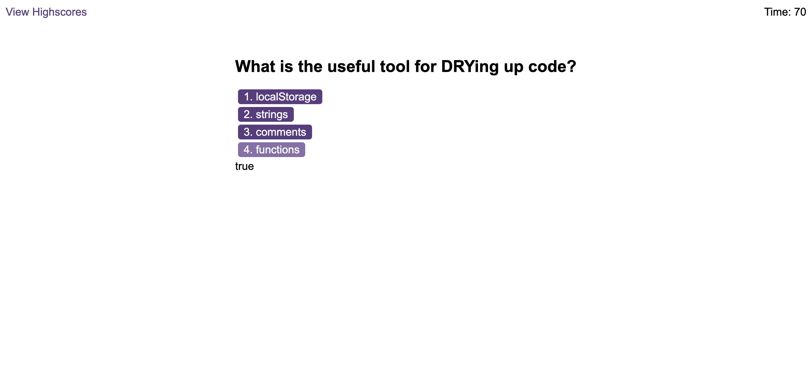
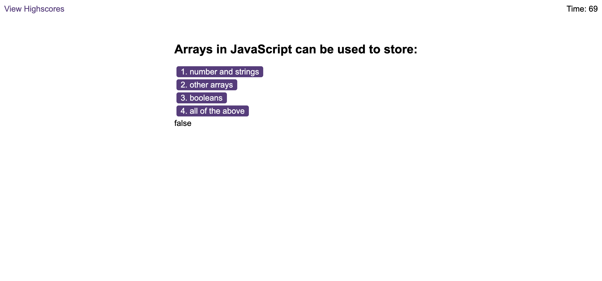

# Coding-Quiz

## Table of Contents

- [Description](#description)
- [Installation](#installation)
- [Usage](#usage)
- [Credits](#credits)
- [License](#license)

## Description

I was tasked with building a timed coding quiz with multiple-choice questions. JavaScript is used to create this application.

## Installation

1. Clone the GitHub repository
2. Open the VS Code with the project.
3. Right click the file index.html and select `"open with live server"`.
4. Follow the instructions on the page.

## Usage

The site is deployed here: https://gizem03.github.io/Coding-Quiz/

When you deploy or run the application you will see the following site on your browser.

Choosing the true answer:

Choosing the false answer:

## Credits

- https://developer.mozilla.org/en-US/docs/Web/JavaScript
- https://www.w3schools.com/js/default.asp

## License

This project is using MIT license. You can view the license [here](license.txt).
